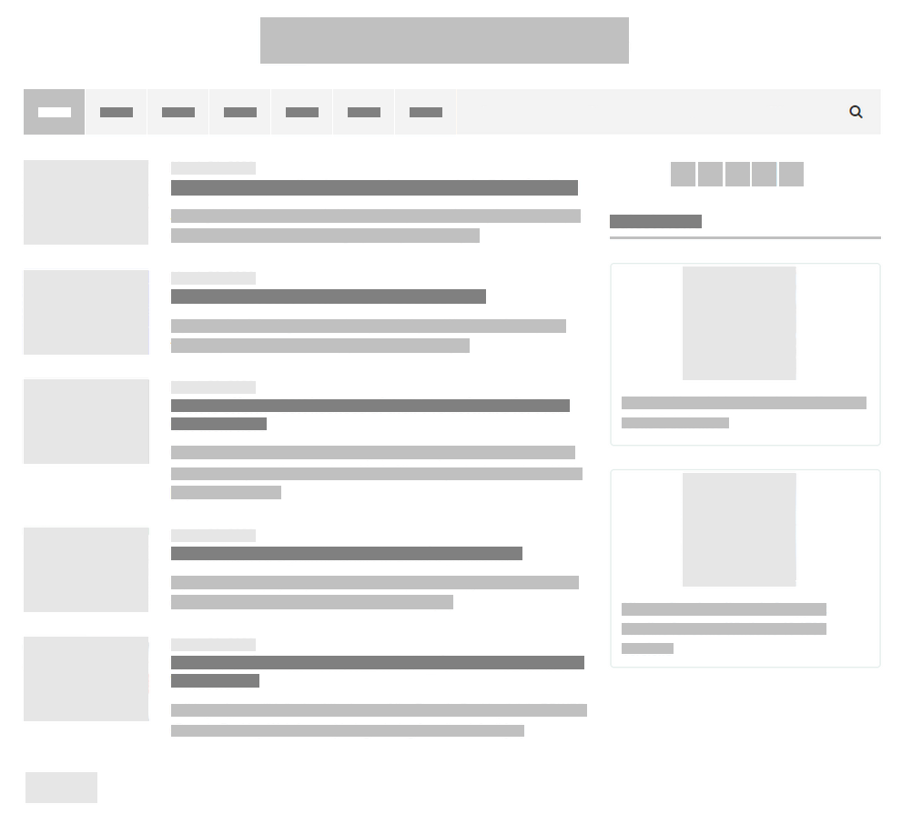
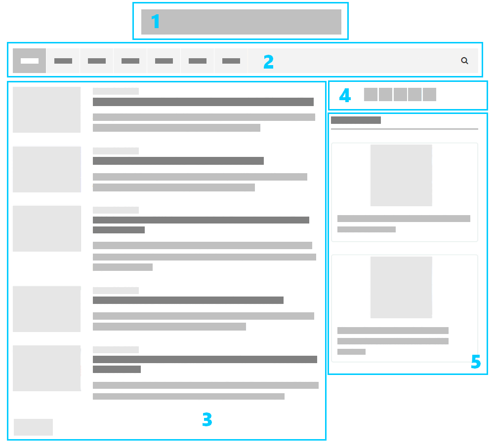

# DESAFIO direciona.me
 
## Instruções
 
- Para solucionar o desafio você deve usar o framework ReactJS.
- A solução final deve estar em um repositório git público, contando com uma documentação que possibilite a execução em qualquer outra máquina.
 
## O que fazer?
 
Recriar o wireframe (Site de Noticias) abaixo, utilizando o conceito de componentes.
 

 
## Sobre o wireframe
 

 
1. Logo e titulo
1. Barra de navegação
    - Navegação para outras páginas
    - Barra de pesquisa
1. Área de noticias
    - Noticia
        - Imagem
        - Data
        - Título
        - Breve descrição
    - Botão para próxima página de notícias
1. Área para mídias sociais
1. Destaques
    - Noticia
        - Imagem
        - Titulo
